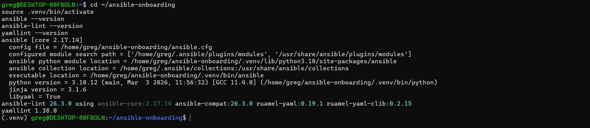
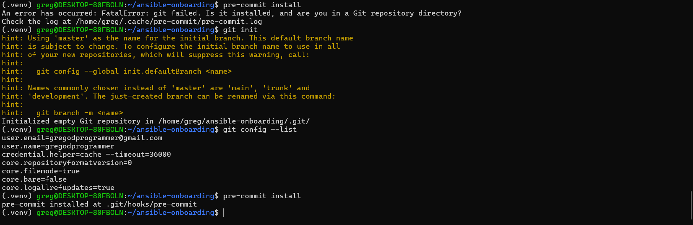
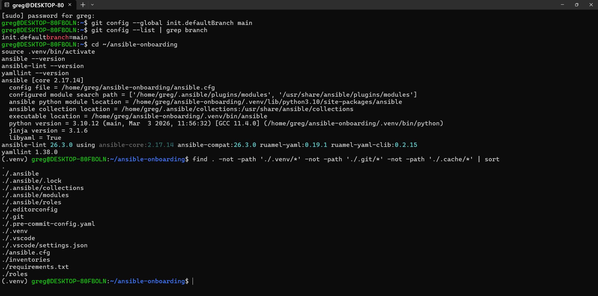
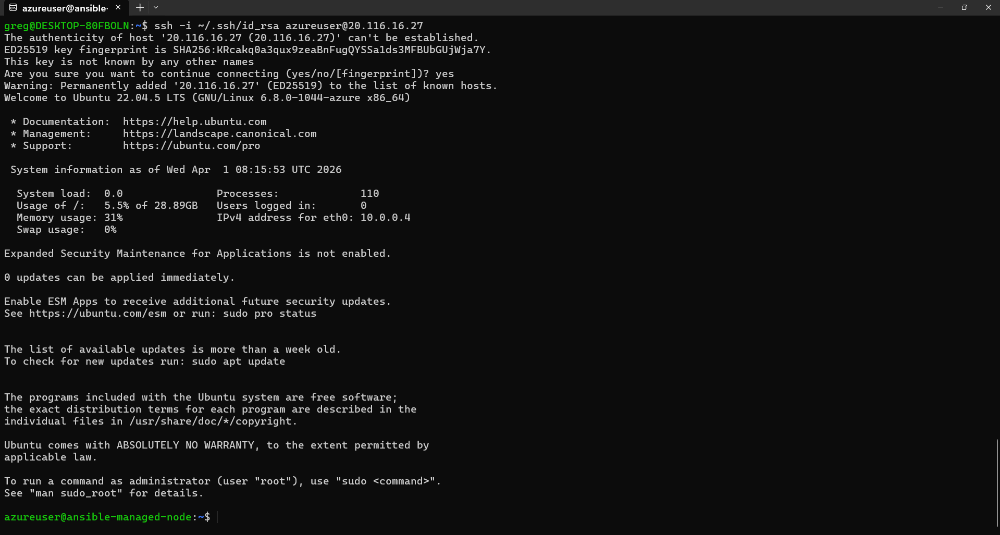
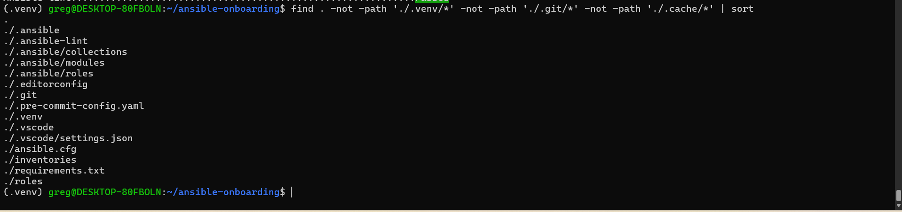

# ansible-onboarding
> Production-ready Ansible DevOps workstation setup — IBT DevOps Assignment 1


---

## Overview

This repository documents the setup of a production-ready Ansible developer workstation following real-world team standards. The setup includes isolated Python environments, VS Code tooling, SSH configuration, Git hygiene, and reproducible developer onboarding.

**Architecture:**
- **Control Node:** WSL2 Ubuntu 22.04 LTS (local machine)
- **Managed Node:** Azure Ubuntu 22.04 VM (canadacentral, Standard_B2ats_v2)

---

## System Details

| Component | Details |
|---|---|
| OS | Windows 11 + WSL2 Ubuntu 22.04 LTS |
| Python | 3.10.12 |
| Ansible | core 2.17.14 |
| ansible-lint | 26.3.0 |
| yamllint | 1.38.0 |
| Azure VM | Standard_B2ats_v2, Ubuntu 22.04, canadacentral |

---

## Screenshots

### ansible --version


### pre-commit run --all-files — Passed


### ssh-add -l — Key Loaded


### SSH into Azure VM


### Repo Tree


---

## Quick Start (New Machine)

```bash
# 1. Clone repo
git clone https://github.com/gregodprogrammer/ansible-onboarding.git
cd ansible-onboarding

# 2. Create and activate venv
python3 -m venv .venv && source .venv/bin/activate

# 3. Install dependencies
python -m pip install -r requirements.txt

# 4. Install pre-commit hooks
pre-commit install

# 5. Verify
ansible --version
ansible-lint --version
pre-commit run --all-files
```

---

## SSH Setup

```bash
# Start SSH agent
eval "$(ssh-agent -s)"
ssh-add ~/.ssh/id_rsa

# Verify key loaded
ssh-add -l

# Connect to Azure VM
ssh -i ~/.ssh/id_rsa azureuser@<PUBLIC_IP>
```

> **Note:** Private key (`~/.ssh/id_rsa`) is never committed to the repository.

---

## Project Structure

```
ansible-onboarding/
├── .ansible-lint              # Excludes .venv from linting
├── .editorconfig              # Consistent formatting rules
├── .gitignore                 # Excludes .venv, logs, retry files
├── .pre-commit-config.yaml    # yamllint + ansible-lint hooks
├── .venv/                     # Isolated Python environment (local only)
├── .vscode/
│   └── settings.json          # Python interpreter + Ansible lint settings
├── ansible.cfg                # Team-friendly Ansible defaults
├── inventories/               # Placeholder for future inventory files
├── requirements.txt           # Pinned pip dependencies
└── roles/                     # Placeholder for Ansible roles
```

---

## Key Configuration Files

### ansible.cfg
```ini
[defaults]
inventory            = inventories/
roles_path           = roles:./.ansible/roles
host_key_checking    = True
retry_files_enabled  = False
interpreter_python   = auto_silent
forks                = 10
timeout              = 30
stdout_callback      = yaml
bin_ansible_callbacks = True

[ssh_connection]
pipelining = True
ssh_args   = -o ControlMaster=auto -o ControlPersist=60s
```

### .vscode/settings.json
```json
{
  "python.defaultInterpreterPath": "${workspaceFolder}/.venv/bin/python",
  "ansible.python.interpreterPath": "${workspaceFolder}/.venv/bin/python",
  "ansibleLint.enabled": true,
  "yaml.validate": true,
  "files.trimTrailingWhitespace": true,
  "editor.formatOnSave": true
}
```

---

## VS Code Extensions

| Extension | Purpose |
|---|---|
| Red Hat Ansible | Playbook syntax, linting, snippets |
| YAML (Red Hat) | YAML validation and formatting |
| Python | Interpreter selection, venv support |
| EditorConfig | Consistent formatting across editors |

---

## Git Configuration

```
user.name  = gregodprogrammer
user.email = gregodprogrammer@gmail.com
init.defaultBranch = main
```

---

## New Machine Checklist

- [ ] Install WSL2 Ubuntu 22.04 and run `sudo apt update && sudo apt upgrade`
- [ ] Install Azure CLI: `curl -sL https://aka.ms/InstallAzureCLIDeb | sudo bash`
- [ ] Confirm SSH key exists at `~/.ssh/id_rsa` or generate new one
- [ ] Add SSH agent auto-start to `~/.bashrc`
- [ ] Create Azure VM with `--ssh-key-values ~/.ssh/id_rsa.pub`
- [ ] Test SSH: `ssh -i ~/.ssh/id_rsa azureuser@<PUBLIC_IP>`
- [ ] Create venv: `python3 -m venv .venv && source .venv/bin/activate`
- [ ] Install tools: `pip install ansible ansible-lint yamllint pre-commit`
- [ ] Create config files: `ansible.cfg`, `.editorconfig`, `.vscode/settings.json`, `.ansible-lint`
- [ ] Run `git init` then `pre-commit install`
- [ ] Verify: `ansible --version`, `ansible-lint --version`, `pre-commit run --all-files`
- [ ] Install VS Code extensions: Red Hat Ansible, YAML, Python, EditorConfig

---

## Challenges & Deviations

| Challenge | Fix Applied |
|---|---|
| Old expired Azure account on CLI | `az logout` + `az account clear` + fresh `az login` |
| SSH agent not running | `eval "$(ssh-agent -s)"` + added auto-start to `~/.bashrc` |
| `pre-commit install` before `git init` | Ran `git init` first |
| ansible-lint scanned `.venv/` — 20,752 false failures | Added `.ansible-lint` with `exclude_paths: .venv/` |
| Assignment requires `id_ed25519` | Used existing `id_rsa` — avoids key sprawl |
| VM size `Standard_B1s` | Used `Standard_B2ats_v2` — only free-eligible size in canadacentral |

---

## Author

**gregodprogrammer** — IBT Certified DevOps Engineer | Agentic AI Builder | Founder HOCS Nigeria

- GitHub: [@gregodprogrammer](https://github.com/gregodprogrammer)
- LinkedIn: [linkedin.com/in/gregodi](https://linkedin.com/in/gregodi)

---

## DMI Micro-Internship

This project was completed as part of the **DevOps Micro-Internship (DMI) Cohort-2** program.

| Detail | Info |
|---|---|
| Program | DevOps Micro-Internship (DMI) Cohort-2 |
| Assignment | Assignment 1 — Ansible DevOps Workstation Onboarding |
| Candidate | Greg Odi |
| GitHub | [@gregodprogrammer](https://github.com/gregodprogrammer) |
| LinkedIn | [linkedin.com/in/gregodi](https://linkedin.com/in/gregodi) |
